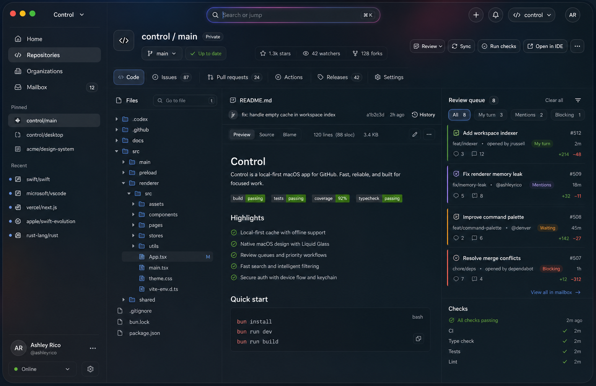
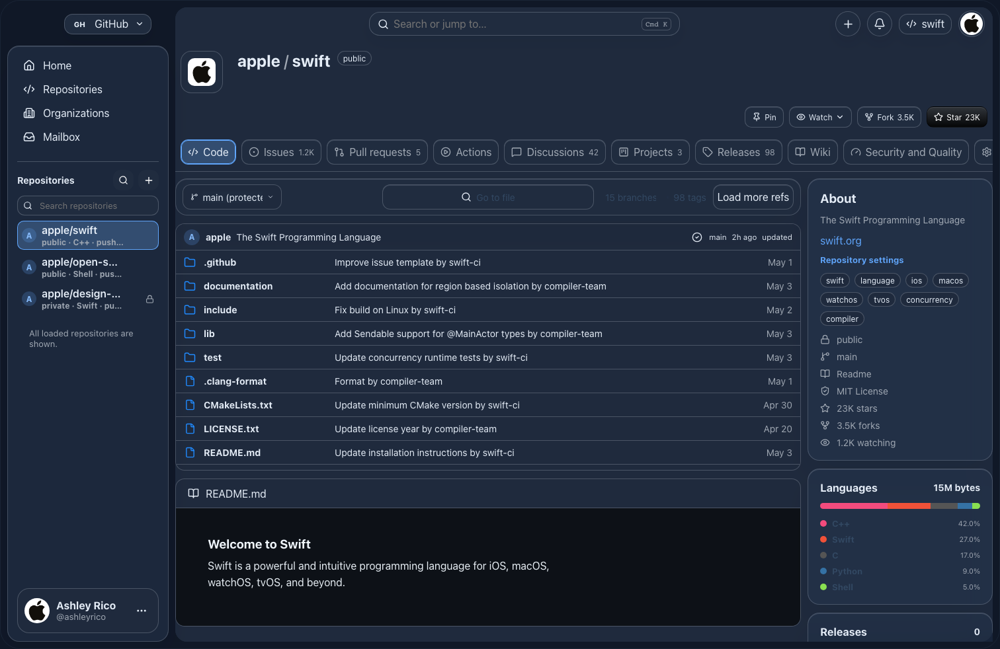
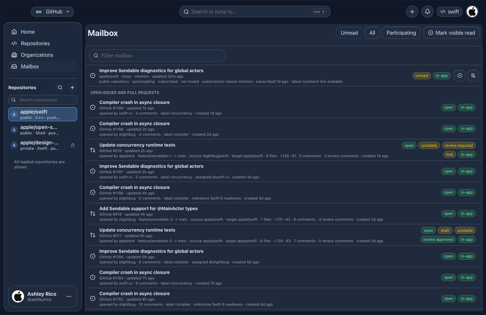

# Liquid Glass Control Concept

## Goal

Make the preferred V3 image real in Control without turning the product into a
stack of glass cards. The design system should feel native, modern, and
macOS-liquid, but Control still has to behave like a dense local-first GitHub
client.

The core rule is:

> Use Liquid Glass as a control material, not as a page material.

Search fields, command surfaces, buttons, selected tabs, segmented filters,
menus, popovers, and compact action groups can be bubble-like Liquid Glass.
Durable work areas stay flatter: sidebar lists, file trees, README/code panes,
issue rows, PR rows, logs, checks, mailbox rows, tables, right rails, and
settings forms should use integrated panes with hairline separators.

## Target Image



This is the north-star visual. It keeps the calmer repository shape from the
second attempt, removes the rejected bottom bar, and reduces card usage across
the page. The app reads as one integrated workspace. The glass is concentrated
on floating controls and transient UI.

## Baseline Images

These captures show the current renderer direction that this concept should
modernize.





The existing structure is mostly right: persistent sidebar, command/search,
repository tabs, central content, and right rail. The weak part is material
assignment. Too many durable surfaces share the same glass/card treatment, so
the app reads as blue slabs with boxed regions instead of one calm workspace
with liquid controls.

## Design Position

### Keep

- Persistent left navigation.
- Dense repository pages.
- Top search/jump surface.
- Right rail for repository metadata and review queues.
- Existing local-first app shell and route structure.
- Shared primitive direction in `src/renderer/src/components/ui/primitives.tsx`.
- Native glass boundary in `src/main/theme/liquidGlassOptions.ts`.

### Change

- Reduce page-level cards and nested cards.
- Flatten large regions into integrated panes.
- Make search, icon buttons, segmented controls, tabs, and popovers share one
  glossy Liquid Glass control treatment.
- Make selected states more luminous through rim, glow, and focused fill.
- Stop using backdrop blur on repeated rows or large content panes.
- Stop treating right rail sections as independent floating glass cards.
- Converge local repository chrome and GitHub repository chrome.

### Reject

- Bottom workflow bars.
- Playback-bar metaphors from Music.
- Full-window decorative blur as the main visual idea.
- Per-row glass in virtualized lists.
- Giant cards for every route section.
- UI cards inside other UI cards.
- Translucent code, markdown, logs, or dense tables that hurt contrast.
- Route-local one-off color/radius/shadow systems.

## Layout Sketch

```text
+--------------------------------------------------------------------------+
| traffic lights     area selector     [ search or jump ]        actions   |
+-------------------+------------------------------------------------------+
| sidebar pane      | repository header and action controls                |
|                   | [ Code ] [ Issues ] [ Pull requests ] ...            |
| nav rows          +--------------------------------------+---------------+
| repo search       | flat content pane                    | flat rail     |
| repo rows         | - file tree / list / timeline        | - queue       |
| status footer     | - README / code / detail             | - metadata    |
|                   | - checks / logs / settings rows      | - actions     |
+-------------------+--------------------------------------+---------------+
```

Material mapping in the sketch:

- Top search, area selector, action buttons, active tab, rail action buttons:
  Liquid Glass controls.
- Sidebar, central content, right rail: flat integrated panes.
- Popovers, command palette, menus, dialogs: transient Liquid Glass overlays.
- Rows, code, markdown, tables, logs: no backdrop blur.

## Surface Taxonomy

| Surface kind           | Meaning                             | Material rule                                                      | Examples                                                            |
| ---------------------- | ----------------------------------- | ------------------------------------------------------------------ | ------------------------------------------------------------------- |
| Native window material | The macOS shell behind the renderer | Owned by Electron native glass; keep renderer root transparent     | `app-shell`, traffic-light area, rounded window edge                |
| Integrated pane        | Persistent layout region            | Flat low-alpha pane, hairline borders, no backdrop blur by default | sidebar, repository workspace, file tree, right rail, settings main |
| Content canvas         | High-legibility work area           | Solid or near-solid background, no glass                           | code, markdown, logs, diffs, tables                                 |
| Dense row              | Repeatable list item                | Flat row fill, stable height, no shadow, no blur                   | repository rows, issue rows, mailbox rows, workflow rows            |
| Glass control          | User action or choice               | Bubble capsule, rim highlight, focused glow, fixed dimensions      | search, icon buttons, segmented filters, selected tabs, chips       |
| Transient glass        | Temporary layer above dense content | Stronger blur, shadow, border, escape/focus containment            | command palette, search popover, menus, dialogs, file finder        |
| Status treatment       | Semantic availability or state      | Tokenized color rail/chip/banner; not decorative glass             | stale cache, error, warning, success, blocked, passing checks       |

## Material Token Contract

Existing tokens in `src/renderer/src/styles.css` and
`src/renderer/src/theme/themeSettings.ts` should be kept, but the concept needs
clearer semantic separation. Add or derive these tokens before broad route work.

| Token                          | Purpose                         | Rule                                       |
| ------------------------------ | ------------------------------- | ------------------------------------------ |
| `--color-pane-canvas`          | Durable app panes               | Flat, no blur, low visual weight           |
| `--color-pane-canvas-hover`    | Hover on pane-local rows        | Slight lift without shadow                 |
| `--color-content-canvas`       | Code, markdown, logs, tables    | Highest contrast surface                   |
| `--color-content-row`          | Dense repeated rows             | Stable, no blur, no shadow                 |
| `--color-glass-control`        | Search, buttons, tabs, segments | Low-alpha glass with rim                   |
| `--color-glass-control-hover`  | Hovered control                 | Brighter rim and fill                      |
| `--color-glass-control-active` | Selected tab/filter/control     | Accent-tinted luminous fill                |
| `--color-glass-rim`            | Control border/rim              | White-tinted in dark, neutral in light     |
| `--color-focus-glow-blue`      | Keyboard/focus glow             | Primary focus accent                       |
| `--color-focus-glow-pink`      | Search/command accent glow      | Sparse use, not global theme               |
| `--shadow-control-float`       | Floating buttons/search         | Small elevation only                       |
| `--shadow-overlay-float`       | Palette/popover/dialog          | Strong separation from content             |
| `--radius-liquid-control`      | Bubble controls                 | 999px for pills, circular for icon buttons |
| `--radius-pane`                | Integrated panes                | 14px to 18px; low drama                    |
| `--radius-row`                 | Dense rows                      | 8px to 10px                                |
| `--material-pane-blur`         | Pane blur                       | `0px` for durable panes                    |
| `--material-overlay-blur`      | Overlay blur                    | Existing transient blur token              |

The important behavioral invariant: changing a pane token should not make rows
or large work areas glossy. Glass belongs to controls and transient overlays.

## Primitive Contract

The shared primitive layer should become the implementation boundary for this
visual language.

### Existing primitives to preserve

- `Surface`
- `FilterBar`
- `StateSegmentedControl`
- `IconButton`
- `ExternalLinkButton`
- `StateChip`
- `DetailLayout`
- `DetailRail`
- `RailSection`
- `Timeline`
- `TimelineEventCard`
- `Composer`
- `FormSection`
- `AvailabilityBanner`
- `EmptyState`
- `LimitHitNotice`
- `RepositoryHero`
- `RepositoryTabs`
- `RepositoryTabSurface`
- `RepositoryRightRail`

### Primitive changes needed

1. Reclassify `Surface` variants by material, not by vague visual intensity.
   `panel` should not imply glass by default. Prefer explicit variants such as
   `pane`, `row`, `content`, `overlay`, `status`, and `danger`.
2. Add a shared glass-control class or primitive behavior used by:
   `IconButton`, `ExternalLinkButton`, `StateSegmentedControl`,
   `RepositoryTabs`, topbar buttons, command scope buttons, and compact action
   groups.
3. Make `FilterBar` an unframed row with glass controls inside it. It should
   not be a large glass card.
4. Make `RailSection` default to flat pane sections. Only its actions can use
   glass buttons.
5. Make `RepositoryHero` an integrated header, not a card. The repo icon can
   use a small material badge, but the whole hero should not be boxed.
6. Converge `src/renderer/src/components/repository/RepositoryChrome.tsx` and
   the shared `RepositoryChrome` in `src/renderer/src/components/ui/primitives.tsx`.
   Do not maintain two independent chrome languages.
7. Keep all icon buttons fixed-size and icon-led. Text buttons are reserved for
   clear commands that need labels.
8. Keep dense rows stable in height and free of layout-shifting hover effects.

## Global Surface Map

| App surface                   | Current files                                               | Target treatment                                         | Notes                                                                              |
| ----------------------------- | ----------------------------------------------------------- | -------------------------------------------------------- | ---------------------------------------------------------------------------------- |
| Native macOS window           | `src/main/theme/liquidGlassOptions.ts`, `src/main/index.ts` | Native material behind transparent renderer              | Keep `tintColor` neutral. Change `opaque` only with focused/unfocused screenshots. |
| Root shell                    | `src/renderer/src/App.tsx`, `src/renderer/src/styles.css`   | Transparent rounded app frame                            | Do not paint opaque backgrounds over native glass on macOS.                        |
| Topbar                        | `src/renderer/src/components/topbar/TopBar.tsx`             | Transparent layout rail with glass controls              | Search is the hero control; buttons are small bubbles.                             |
| Area selector                 | `src/renderer/src/components/areas/AreaTopbarSelector.tsx`  | Glass dropdown button and transient glass menu           | Menu rows are flat inside overlay.                                                 |
| Top search                    | `TopBar.tsx`, command palette controller                    | Large liquid search capsule with blue/pink focus rim     | Popover is transient glass; result rows are flat.                                  |
| Top actions                   | `TopBar.tsx`                                                | Circular glass icon buttons plus avatar bubble           | Fixed dimensions, visible titles/labels.                                           |
| Sidebar                       | `Sidebar.tsx`                                               | Flat integrated pane                                     | Nav/repo rows flat; active row gets luminous rim/fill.                             |
| Sidebar repo filter           | `Sidebar.tsx`                                               | Small glass search capsule                               | Keep within flat sidebar pane.                                                     |
| User footer/status            | `Sidebar.tsx`                                               | Compact flat status row with small glass settings button | Avoid cardy footer treatment.                                                      |
| Workspace                     | `App.tsx`                                                   | Flat route canvas                                        | Do not wrap whole routes in floating cards.                                        |
| Command palette               | `CommandPalette.tsx`                                        | Flagship transient glass surface                         | Large search lens, segmented scopes, grouped rows, optional preview rail.          |
| File finder                   | `FileFinder.tsx`                                            | Same overlay system as command palette                   | Ref picker is glass control; result rows flat.                                     |
| Add repository dialog         | `AddRepositoryDialog.tsx`                                   | Transient glass overlay                                  | Form fields use control glass; body content flat.                                  |
| Confirmation and Area dialogs | `ConfirmDialog.tsx`, `AreaDialogs.tsx`                      | Compact transient overlays                               | Danger actions semantic, not red-glass decoration.                                 |
| Settings sheet                | `SettingsPanel.tsx`, `DataSyncPanel.tsx`                    | Flat modal shell with glass controls                     | Navigation and sections are panes; segmented controls glass.                       |

## Repository Surface Map

| Repository surface                    | Current files                                      | Target treatment                      | Implementation note                                               |
| ------------------------------------- | -------------------------------------------------- | ------------------------------------- | ----------------------------------------------------------------- |
| Repository page grid                  | `RepositoryPage.tsx`, `RepositoryRouteSection.tsx` | Integrated workspace, no route card   | Keep central and rail columns.                                    |
| Repository hero                       | `RepositoryPage.tsx`, `RepositoryChrome.tsx`       | Flat integrated header                | Actions become glass bubbles; title/chips sit directly on canvas. |
| Repository icon                       | `RepositoryPage.tsx`, `RepositoryChrome.tsx`       | Small badge, restrained glass allowed | Do not make hero card depend on it.                               |
| Repository actions                    | `RepositoryPage.tsx`                               | Glass control group                   | Star/watch/fork/pin/refresh/actions share one style.              |
| Repository tabs                       | `RepositoryPage.tsx`, shared `RepositoryTabs`      | Glass segmented rail                  | Active tab gets luminous bubble; inactive tabs remain quiet.      |
| Hidden tab notice                     | `RepositoryPage.tsx`                               | Flat status pane                      | Actions use glass buttons.                                        |
| Cached/mutation banners               | `RepositoryPage.tsx`                               | Semantic status strips                | Use availability tokens and small left status rail.               |
| Right rail                            | `RightRail.tsx`, shared `RepositoryRightRail`      | Flat rail, section separators         | Avoid floating glass cards.                                       |
| Rail sections                         | `RightRail.tsx`, `RailSection`                     | Flat groups with hairlines            | Action buttons/chips can be glass.                                |
| About/languages/releases/contributors | `RightRail.tsx`                                    | Flat metadata lists                   | Topic chips can use small glass-control material.                 |
| Commit history rail                   | `CommitHistoryPanel.tsx`                           | Flat row list                         | No backdrop blur on commit rows.                                  |

## Code And Document Surfaces

| Surface           | Current files                              | Target treatment                 | Notes                                               |
| ----------------- | ------------------------------------------ | -------------------------------- | --------------------------------------------------- |
| Code tab layout   | `CodeTab.tsx`                              | Split flat pane                  | File tree and README/code share a calm pane system. |
| File tree         | `CodeTab.tsx`, `CodeBrowserPage.tsx`       | Flat list with selected row fill | Virtualized rows stay blur-free.                    |
| Ref/branch picker | `CodeTab.tsx`, `FileFinder.tsx`            | Glass dropdown control           | Popover/menu transient glass.                       |
| Code toolbar      | `CodeTab.tsx`, `CodeSourceView.tsx`        | Glass control strip              | Buttons/search glass; code content solid.           |
| README/markdown   | `MarkdownBody.tsx`, `CodeTab.tsx`          | Content canvas                   | Use document tokens. No translucent markdown.       |
| Code viewer       | `CodeSourceView.tsx`, `codeHighlighter.ts` | Solid code canvas                | Preserve syntax contrast and gutter readability.    |
| Diffs/logs        | PR panels, Actions logs                    | Solid content canvas             | Logs use dark solid token, not glass.               |

## Issues, Pull Requests, And Queue Surfaces

| Surface                 | Current files                                       | Target treatment                         | Notes                                             |
| ----------------------- | --------------------------------------------------- | ---------------------------------------- | ------------------------------------------------- |
| Issue filter bar        | `IssuesTab.tsx`                                     | Unframed bar with glass controls         | Search, Open/Closed/All, create button.           |
| Issue rows              | `IssuesTab.tsx`                                     | Flat rows with status rails/chips        | No row cards, no row blur.                        |
| Issue preview/detail    | `IssuesTab.tsx`, issue subcomponents                | GitHub-like detail layout                | Timeline main, flat metadata rail.                |
| Issue metadata controls | `IssueMetadataControls.tsx`                         | Flat fields with glass select/buttons    | Keep labels, assignees, milestone readable.       |
| Issue composer/actions  | `IssueCommentComposer.tsx`, `IssueActionFooter.tsx` | Composer pane plus glass buttons         | Do not over-gloss textarea/content.               |
| PR filter bar           | `PullRequestsTabContent.tsx`                        | Same as Issues                           | Shared `FilterBar` and `StateSegmentedControl`.   |
| PR rows                 | `PullRequestList.tsx`, PR content                   | Flat rows with review/check status rails | Diff/merge status as semantic chips.              |
| PR detail               | PR panels in `pull-requests/`                       | Timeline main, flat rail                 | Reviewers/checks/metadata on rail.                |
| PR checks/files/commits | PR panels                                           | Content canvases                         | Files and logs stay solid/high contrast.          |
| Mailbox queue           | `MailboxRoute.tsx`, collection UI                   | Account-level flat queue                 | Segmented filters and actions are glass controls. |
| Review queue rail       | repository rail and mailbox detail                  | Flat queue with colored priority rails   | This replaces any bottom bar idea.                |

## Route Surface Map

| Route                | Current files                                            | Target modernization                                                                                                                                               |
| -------------------- | -------------------------------------------------------- | ------------------------------------------------------------------------------------------------------------------------------------------------------------------ |
| Home                 | `HomeDashboard.tsx`                                      | Make the account/profile header integrated, reduce card framing on activity sections, keep repeated repo/work rows flat, make refresh/open actions glass controls. |
| Repositories         | `RepositoriesRoute.tsx`, `collectionUi.tsx`              | Flat repository table/list, glass filter/search/actions, consistent local/GitHub row model.                                                                        |
| Organizations        | `OrganizationsRoute.tsx`, organization state/query files | Flat org/team/member/project columns, glass selector/filter controls, section-level availability strips.                                                           |
| Mailbox              | `MailboxRoute.tsx`, `notificationUi.ts`, `workItemUi.ts` | Treat as the flagship queue route: flat rows, active selection rim, glass filters/actions, right detail pane when needed.                                          |
| Code browser         | `CodeBrowserPage.tsx`, `CodeSourceView.tsx`              | Same code/document canvas as repository Code, with glass path/ref controls.                                                                                        |
| Local repository     | `LocalRepositoryPage.tsx`, local repo helpers            | Converge with shared repository chrome and tabs. Local-only surfaces use the same pane/row/control taxonomy.                                                       |
| Actions              | `ActionsTab.tsx`                                         | Workflow catalog and run list are flat panes, run filters and action buttons are glass, logs/artifacts/annotations use content canvases.                           |
| Projects             | `ProjectsTab.tsx`                                        | Flat project lists with glass actions; partial GraphQL errors render as section availability.                                                                      |
| Agents               | `AgentsTab.tsx`                                          | Operational panes, not promo cards. Use compact status rows and glass actions that open filtered repo surfaces.                                                    |
| Wiki                 | `WikiTab.tsx`                                            | Page list plus markdown editor/preview. List and document flat; create/edit/delete controls glass.                                                                 |
| Security and Quality | `SecurityQualityTab.tsx`                                 | Alert lists/tables flat with severity rails; state filters glass; branch protection/rulesets are form panes.                                                       |
| Settings tab         | `RepositorySettingsTab.tsx` and settings sections        | Grouped admin panes with glass controls and semantic danger/status rows.                                                                                           |
| App settings         | `SettingsPanel.tsx`, `DataSyncPanel.tsx`                 | Modal shell can be glass, but settings body is flat; segmented choices, swatches, toggles, buttons use glass/control tokens.                                       |

## Modern Surface Rules

### Durable panes

- Use one border and one background token.
- Prefer separators over nested boxes.
- Avoid pane shadows except for true overlays.
- Do not blur durable panes by default.
- Do not place pane cards inside pane cards.
- Use `min-width: 0`, fixed row heights, and explicit scroll containers.

### Controls

- Use fixed dimensions for icon buttons.
- Use capsules for search and segmented controls.
- Use a visible rim, inner highlight, and hover/focus states.
- Prefer icons from `lucide-react` for icon buttons.
- Provide `aria-label`, `title`, or visible text.
- Keep text labels only where a command is not obvious.

### Rows

- Stable height for list rows.
- Selected row uses fill/rim, not shadow.
- Hover uses a subtle flat fill.
- Status should be a left rail, chip, or small inline badge.
- No per-row `backdrop-filter`.
- No row-level drop shadows in virtualized lists.

### Overlays

- Command palette, file finder, menus, and dialogs can use stronger glass.
- Overlays need focus containment, escape behavior, and visible active rows.
- Large overlay body rows remain flat inside the glass shell.
- Dialog actions use shared glass controls and semantic danger states.

### Documents and code

- Code, markdown, logs, diffs, and tables use content tokens.
- Do not make documents transparent to wallpaper.
- Preserve GitHub-like contrast and scroll behavior.
- Syntax colors and gutter colors belong to document/source tokens, not app
  glass tokens.

## Component Migration Notes

### `styles.css`

The stylesheet currently mixes app tokens, route-specific hard-coded colors,
and shared primitive styles. The migration should first add semantic material
tokens, then migrate selectors in batches:

1. Native/root shell tokens.
2. Shared control tokens.
3. Shared pane/content/row tokens.
4. Existing shell selectors: `.topbar`, `.sidebar`, `.workspace`,
   `.search-wrap`, `.top-actions`.
5. Repository selectors: `.repo-page`, `.repo-hero`, `.repo-tabs`,
   `.right-rail`, `.rail-panel`.
6. Shared primitive selectors: `.ui-*`.
7. Route-specific selectors.

Do not start by mass-replacing every `rgba`. Start by establishing the material
contract, then migrate the high-visibility routes.

### `src/renderer/src/components/ui/primitives.tsx`

This is the right place to encode most new behavior. The migration should make
shared primitives carry the design language:

- `Surface` for flat panes and status regions.
- `GlassControl` behavior through button/control classes or props.
- `FilterBar` as layout only, not a glass card.
- `StateSegmentedControl` as a liquid choice control.
- `RepositoryTabs` as the route tab control.
- `DetailRail` and `RailSection` as flat metadata/queue surfaces.
- `Composer` and `FormSection` as flat forms with glass actions.

### Repository chrome convergence

There are currently two repository chrome directions:

- `src/renderer/src/components/repository/RepositoryChrome.tsx`
- `src/renderer/src/components/ui/primitives.tsx`

The concept should converge on one shared chrome contract that supports:

- GitHub repositories.
- Local repositories.
- Local repositories connected to GitHub.
- Repository tabs.
- Status chips.
- Header action groups.
- Optional path/workspace metadata.

Local repository pages should stop looking like a separate product once this
chrome is in place.

## Native Glass Boundary

Native Liquid Glass is not the same as renderer CSS blur. Keep this boundary
clear:

- `src/main/theme/liquidGlassOptions.ts` owns native view options.
- `src/main/index.ts` applies the native view.
- Renderer `html`, `body`, `#root`, and `app-shell` must not hide native glass
  on macOS.
- `body.no-liquid-glass` owns fallback CSS material on non-macOS.
- Native `tintColor` must remain neutral unless screenshots prove otherwise.
- Changing `opaque`, `scrim`, or `subdued` requires focused and unfocused
  macOS captures over neutral, blue, and yellow backgrounds.

This concept can be mostly implemented through renderer tokens and shared
primitives before changing native options.

## Implementation Order

### 1. Lock the material vocabulary

- Add token names for pane, content, row, glass control, overlay, rim, glow,
  and control shadow.
- Update `docs/design/design-system.md` after implementation starts so it
  matches this more restrained rule: durable panes are flat, controls are glass.
- Keep `docs/wip/control-ux-implementation/01-theme-liquid-glass-foundation.md`
  as the native verification contract.

### 2. Update shared primitives

- Rework `Surface` variants around material purpose.
- Make `StateSegmentedControl`, `IconButton`, `ExternalLinkButton`, and
  `RepositoryTabs` use the new glass control treatment.
- Make `FilterBar`, `RailSection`, `FormSection`, `Composer`, and
  `RepositoryHero` default to flat pane language.
- Add or adjust unit tests in `uiPrimitives.test.tsx` when class contracts or
  ARIA behavior change.

### 3. Modernize shell controls

- Top search becomes the strongest everyday Liquid Glass element.
- Area selector, create, notifications, context, and avatar controls get the
  same bubble system.
- Sidebar stays flat and integrated. Only sidebar search/settings controls get
  glass.
- Verify drag regions remain correct.

### 4. Modernize transient overlays

- Command palette becomes the flagship overlay.
- File finder and add-repository dialog adopt the same overlay material.
- Search popovers and area menus use the same transient overlay rules.
- Result rows stay flat inside overlays.

### 5. Modernize repository chrome and Code

- Flatten repository hero and right rail.
- Rework tabs as glass segmented controls.
- Move repository action groups into shared glass controls.
- Keep file tree, README, code, commit history, and rail metadata flat.
- Use `current-repository-code-dark.png` as the primary before/after route.

### 6. Modernize queue surfaces

- Apply the same filter/control language to Issues, Pull Requests, and Mailbox.
- Rows stay flat with status rails and chips.
- Detail pages use `DetailLayout`: timeline/content main plus flat metadata
  rail.
- This is where the Music "queue" idea translates into Control: right rails
  and mailbox queues, not bottom bars.

### 7. Modernize admin and operational routes

- Actions, Wiki, Security and Quality, Repository Settings, Organizations, and
  Local Repository pages migrate after the shared primitives prove out.
- Each route should remove boxed section carding and adopt pane/content/row
  taxonomy.
- Logs, markdown, code, and dense tables stay solid.

### 8. Native material validation

- Run Electron, not just Vite, for focused/unfocused and native material checks.
- Capture light solid, dark solid, dark glass shell, dark reduced glass, and
  unfocused states.
- Do not ship native option changes without screenshot evidence.

## Work Area Alignment

| WIP file                              | How this concept changes the work                                                  |
| ------------------------------------- | ---------------------------------------------------------------------------------- |
| `00-shared-program.md`                | Treat this file as the visual north star before route slices start.                |
| `01-theme-liquid-glass-foundation.md` | Add the control-vs-pane material split to token cleanup and primitive work.        |
| `03-issues.md`                        | Filter controls and action buttons get glass; rows/detail/timeline/rail stay flat. |
| `04-pull-requests.md`                 | Same queue/detail rules as Issues.                                                 |
| `05-actions.md`                       | Workflow filters/actions glass; workflow lists/logs flat.                          |
| `06-projects-agents.md`               | Agents and Projects should be operational panes, not large cards.                  |
| `07-wiki.md`                          | Page list and document canvas flat; edit/create controls glass.                    |
| `08-security-quality.md`              | Severity states use rails/chips, not glass cards.                                  |
| `09-repository-settings.md`           | Grouped admin panes flat; toggles/selects/buttons glass.                           |
| `10-sidebar-organizations-mailbox.md` | Sidebar and mailbox are key proof points for row/pane/control split.               |
| `11-local-repository-parity.md`       | Shared repository chrome must make local and GitHub pages feel like one product.   |
| `12-cache-validation-invalidation.md` | Availability and stale states use semantic status treatments.                      |
| `13-visual-qa-validation.md`          | Screenshot assertions should check material placement, not just no-overlap.        |

## Acceptance Criteria

The concept is implemented when all of these are true:

- The V3 image is recognizable in the app: flat content panes, glass controls,
  no bottom bar.
- Top search, command palette, tabs, segmented filters, icon buttons, menus,
  and compact action groups visibly share one Liquid Glass control system.
- Sidebar, file tree, README/code, right rail, checks, settings, mailbox rows,
  issue rows, PR rows, logs, and tables are flatter panes or content canvases.
- No high-volume row uses `backdrop-filter`.
- No route adds nested cards for page structure.
- The repository right rail reads as one pane with sections, not a stack of
  floating cards.
- Issues, Pull Requests, and Mailbox use the same queue language.
- Local repository pages share repository chrome with GitHub repository pages.
- Solid, reduced, and glass shell modes remain distinct.
- macOS focused and unfocused states are screenshot-verified before native
  option changes land.
- `bun run format`, `bun run lint`, `bun run typecheck`, and relevant tests
  pass for code changes.

## Screenshot Checklist

Capture these whenever implementing this concept in code:

- Home, dark.
- Repository Code, dark.
- Repository Issues list, dark.
- Repository issue detail, dark.
- Pull request detail, dark.
- Actions run detail with logs, dark.
- Mailbox queue, dark.
- Settings Appearance, dark.
- Local repository overview/code, dark.
- Command palette over repository code, dark.
- Repository Code, light.
- Focused and unfocused Electron window over neutral, blue, and yellow
  backdrops when native options change.

## Design Review Checklist

Use these checks before calling a route migrated:

- Can I point to every glass element and explain why it is a control or
  transient overlay?
- Are there any large page regions using glass only because the old CSS class
  did?
- Are repeated rows blur-free?
- Does selected state work without adding a card?
- Does text still fit at the smallest supported width?
- Does the route still feel dense enough for repeated developer work?
- Does the route still work in solid and reduced glass modes?
- Are all new controls keyboard reachable and labeled?
- Did the change reuse shared primitives instead of route-local styling?

## Notes For Future Image Iteration

If more generated images are needed, prompt for:

- "Control desktop developer tool, macOS Liquid Glass controls only on search,
  buttons, tabs, menus, and chips."
- "Flat integrated panes for sidebar, file tree, code, markdown, right rail,
  review queue, checks, logs, and settings."
- "No bottom bar, no playback metaphor, no floating page cards, no nested
  cards."
- "Quiet graphite app surface with blue focus, green success, amber attention,
  sparse pink search glow."
- "Dense repository workspace, local-first GitHub client, no Apple or GitHub
  logos."

## Open Implementation Questions

- Should `Surface` gain new variants, or should the existing variant names be
  kept and remapped to the new material meanings?
- Should the topbar search and command palette share a new `SearchLens`
  primitive?
- Should repository tabs migrate to shared `RepositoryTabs` immediately, or
  after `RepositoryChrome` convergence?
- Should Mailbox become the first full queue proof point before PR detail, or
  should PR detail drive the queue language first?
- Should native `opaque: false` be tested before or after renderer material
  cleanup? The safer order is renderer cleanup first, native testing second.
